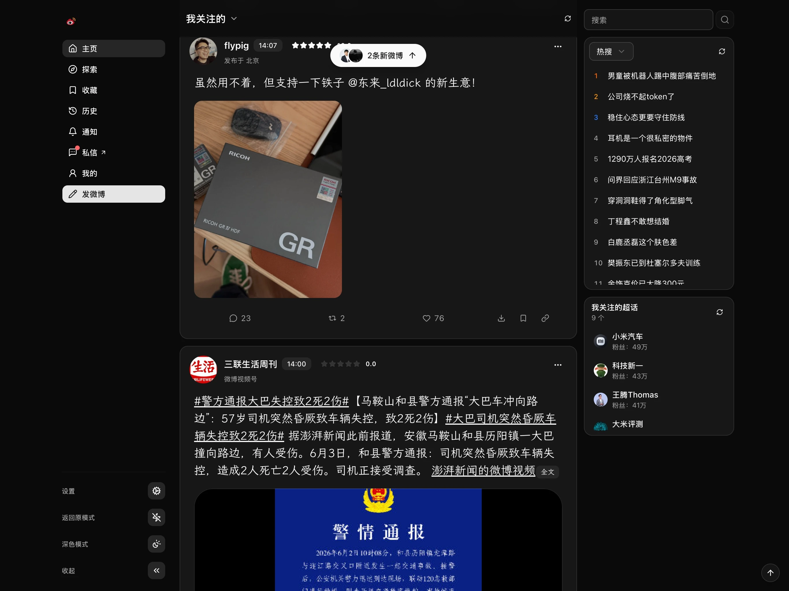

  

<h1 align="center">xb</h1>

  <strong>Redesign Weibo</strong>

like X but even better.

  <a href="./README.md">中文</a>
  ·
  <a href="https://xb-extension.vercel.app/">Website</a>

---

xb strips away the noise and gives you a focused, distraction-free reading
experience — similar to X.

xb is a chrome extension. Once installed, simply browse Weibo as usual and enjoy
the beautifully redesigned interface.

👉 Screenshots and more: [xb website](https://xb-extension.vercel.app/)

## Install

| Browser | Link                                                                                                  |
| ------- | ----------------------------------------------------------------------------------------------------- |
| Chrome  | [Chrome Web Store](https://chromewebstore.google.com/detail/xb/ffhppkcianllofhhjohbfbobjfppbeao)      |
| Firefox | [Firefox Add-ons](https://addons.mozilla.org/en-US/firefox/addon/xb/)                                 |
| Edge    | [Edge Add-ons](https://microsoftedge.microsoft.com/addons/detail/xb/mojlbnkiahdmnfaffmelfcefohpfjjla) |

## Features

1. ✨ **X like Style** — Clean, reading-first.
2. 🔓 **Fully Open Source** — No privacy concerns, open-source totally.
3. 🎯 **Focus on Reading** — Distraction-free, clearly feed.
4. 🚫 **No Interruptions** — No stickers, ads, or supertopics.
5. 🆓 **Everything is Free** - No paid features.
6. 📷 **Take a shot** - Export Weibo as an image with multiple card templates.
7. 🔤 **Custom Font** - Choose from system fonts or downloadable open-source
   fonts.
8. 🎨 **Custom Theme** — Customize theme colors. See
   [Tutorial](https://github.com/nnecec/xb/discussions/54).
9. 📅 **Browsing History** — The history is recorded locally.
10. ⬇️ **Free to downloads** - Supports download and batch download of Weibo
    images and videos.

## Credits

- Inspired by [BewlyBewly](https://github.com/BewlyBewly/BewlyBewly) and
  [BewlyCat](https://github.com/keleus/BewlyCat)
- [Linux Do](https://linux.do/) a friendly community
